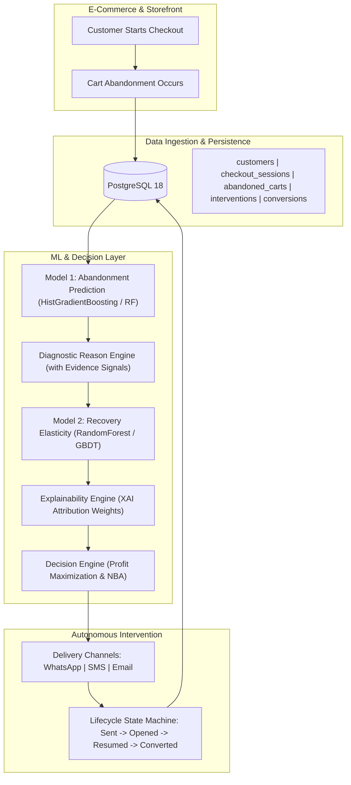

# ReviveAI System Architecture

## Overview
ReviveAI is built as a **production-oriented prototype** designed for e-commerce revenue recovery. The platform connects real-time checkout drop-off signals to machine learning diagnostics, local explainability, and an economic decision engine.

---

## Key Modules
1. **Zero-Leakage Feature Extraction**: Features are strictly partitioned into pre-abandonment session attributes and quarantined post-intervention outcomes.
2. **Diagnostic Reason Engine**: Identifies primary cause (`SHIPPING`, `PAYMENT`, `PRICE`, `TECHNICAL`, `HESITATION`, `TRUST`) with quantitative telemetry evidence.
3. **Local Explainable AI (XAI)**: Attributes positive conversion drivers and risk drag factors explaining the predicted recovery probability.
4. **Economic Decision Engine**: Evaluates expected revenue, discount concessions, delivery costs, and expected profit for all 7 candidate actions to pick the profit-maximizing Next Best Action.
